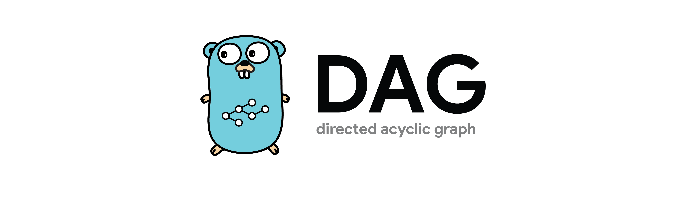

This is a directed acyclic graph implementation in Go written by the Terraform team. The Terraform project recently moved their DAG implementation to the internal directory which means that it can no longer be imported. I ported that package into this repository so that I could utilize the fantastic DAG implementation they have created.

## Features
* Any hash-able structure can be used as a vertex in the graph.
* Request the ancestors or descendents of a specific vertex.
* Breadth-first and depth-first traversals.
* Reverse-breadth-first and reverse-depth-first traversals.

## Examples
* [Ancestors](examples/ancestors_test.go)
* [Descendents](examples/descendents_test.go)
* [Walk](examples/walk_test.go)